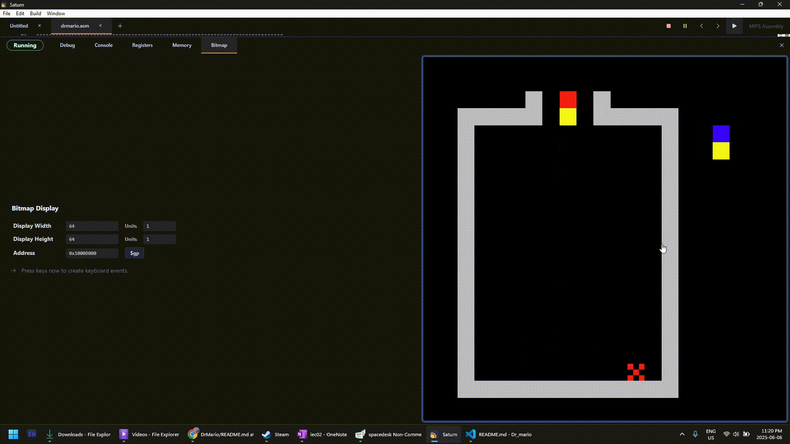

# Welcome to Dr Mario created by Tadd and Rey

We decided to take an old retro game Dr Mario, and use the og retro code of assembly to recreate Dr Mario.

Interested in how we made Dr Mario in assembly? Or maybe you just want to play our version of Dr Mario with custom music, difficulties, and graphics. Well in any case, we got you!

## Installation

- This project uses mips assembly and we used an ide called Saturn to make it so you will need to download Saturn first: https://github.com/1whatleytay/saturn
- Then download the source code from the releases page of this Dr mario repo
- Open Saturn and open the source code you just downloaded into Saturn
- Click the green play button in the top right of the Saturn ide to build the project
- Then you will see a Bitmap tab. Here set the following parameters:
  - Unit width in pixels: 1
  - Unit height in pixels: 1
  - Display width in pixels: 64
  - Display height in pixels: 64
  - Base Address for Display: 0x10008000 ($gp)
- That's everything! See controls section for how to play the game.

## Controls

- First click the green play button in top right of the Saturn ide (assuming you've followed the installation instructions properly)
- You will see a black screen. There are three modes that you can select by pressing the following keys on the keyboard:
  - press 'a' for easy
  - press 's' for medium
  - press 'd' for hard
- You are now in the game!
- 'w' rotates the capsule 90 degrees clockwise
- 'a' moves left
- 'd' moves right
- 's' to fast fall
- That's it! See Rules to better understand the game.

## Rules

- If you are familiar with Dr Mario, you already know the rules. If not, here is a quick rundown:
- You want to eliminate the viruses which look like a checker board
- You can do so by connecting four in a row
- When you get four in a row (or more), blocks above fall down
- The level speeds up as you progress
- That's it!

## Issues

- If you think there is something wrong or you need to reach out for any reason, feel free to create an issue on this repo and we will respond as soon as we have time!
